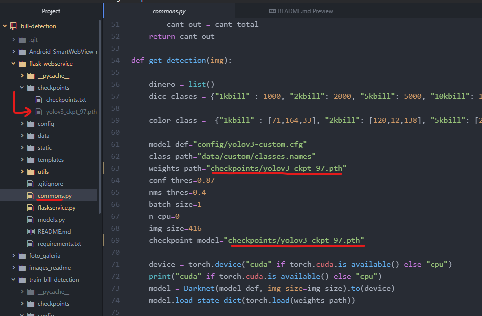

## Detección de billetes
17/12/2020

Autores:

        Francisco Abusleme
        Juan Aguilera
        Rodrigo Graves
        Ricardo Mardones
        Loreto Romero


###  Referencias:
Repositorio usado para el entrenamiento de la red en la detección de billetes
```
https://github.com/puigalex/deteccion-objetos-video
```
Repositorio usado para unir nuestro webservice a una aplicación de android
```
https://github.com/delight-im/Android-AdvancedWebView
```

### Instrucciones:
Si no tiene conda, recomendamos descargar miniconda3 y añadirlo a su path, sino desa añadirlo a su path puede usar Anaconda Prompt para navegar en los ambientes virtuales.

link de descarga:
```
https://docs.conda.io/en/latest/miniconda.html
```

#### Crear un ambiente virtual con conda y activarlo

```
conda create -n <nombre_venv> python=3.6
conda activate <nombre_venv>
```

#### Instalar PyTorch y torchvision

En caso de que tenga disponible GPU

```
pip install torch===1.5.0 torchvision===0.6.0 -f https://download.pytorch.org/whl/torch_stable.html
```

En caso de que solo se tenga disponible cpu
```
pip install torch==1.5.0+cpu torchvision==0.6.0+cpu -f https://download.pytorch.org/whl/torch_stable.html##
```

#### Instalar los requerimientos para el entorno virtual.

```
pip install -r requirements.txt
```
#### Descargar los pesos necesarios para la deteccion en el siguiente link
```
https://drive.google.com/drive/folders/1WUfFYVQJHfnu9zykEf5jZiSoq6v-qNqy?usp=sharing
```
Donde:

Peso funcional cpu: yolov3_ckpt_97.pth

Peso funcional solo gpu: yolov3_ckpt_6.pth

Agregamos este archivo a la carpeta flask-webservice/checkpoints

Notamos que es necesario cambiar este valor en commons.py en las lineas 59 y 65 dependiendo de el peso escogido de la siguente forma:



#### Ejecutar la siguiente linea de codigo para iniciar el webservice

```
python flaskservice.py
```
Todo listo para acceder a su webservice de manera local!

si necesita saber su direccion ip, en la cmd de windows digite

```
ipconfig
```

Esto nos dará la dirección (IPv4) al servidor que nos ayudará a ejecutar la detección de billetes.

##### Nos conectamos desde el navegador webpreferido, ya sea en un computador o dispositivo movil y seleccionar un archivo deseado, luego hacemos click en upload para cargarlo al servidor.


# __Disfrutar de una (aun mejorable) detección de billetes__


# __App movil con reconocimiento de billetes!__

Adicionalmente para implementar este webservice en una aplicación movil capaz de reconocimiento de billetes chilenos Abrimos el proyecto disponible en la carpeta Android-SmartWebView-Master en Android Studio y cambiamos en java/MainActivity la linea 128 por lo siguiente
```
private static String ASWV_URL          = "http://192.168.0.5:5000/";
```
Donde la direccion http://192.168.0.5:5000/ corresponde a la dirección del webservice creado anteriormente.

Como se ve a continuación


Queda por implementar en esta aplicación el uso de la cámara.
# __Entrena tus propios pesos!__

Ahora, si lo que quieres es entrenar un modelo con las clases de billetes que tu quieras, puedes hacerlo siguiendo estas instrucciones.

Deberas crear un amplio data-set con las fotos que utilizarás para el entrenamiento.

Deberás etiquetar las imagenes con el formato .txt de Yolo darknet.

## Cambiar la configuracion del modelo
Debes dirigirte a **train-bill-detection/config** y editar **custom.data** segun la cantidad de clases que tengas, para los billetes chilenso contamos con 5 clases
```
classes = 5
```

## Poner las imagenes y archivos de metadata en las carpetar necesarias

Las imagenes etiquetadas tienen que estar en el directorio **trian-bill-detection/data/custom/images** mientras que las etiquetas/metadata de las imagenes tienen que estar en **trian-bill-detection/data/custom/labels**.
Por cada imagen.jpg debe de existir un imagen.txt (metadata con el mismo nombre de la imagen)


Dentro de **train-bill-detection** se deben generar los archivos ```data/custom/valid.txt``` y ```data/custom/train.txt``` que contendrán la dirección donde se encuentran cada una de las imagenes. Estos  generarán automaticamente  con el siguiente comando (estando las imagenes ya dentro de ```data/custom/images```)
```
python split_train_val.py
```

 Los pesos pre-entrenados de la red neuronal se encuentran en la carpeta se deben descargar desde el siguiente link

```
https://drive.google.com/drive/folders/1IorMOfyKyj8zoiSE2W01gzAYgcXLeqL1?usp=sharing
```
 Se deben guardar dentro de train-bill-detection en una carpeta de nombre __weights__.

## Entrenar
Para poner a entrenar el modelo se debe ejecutar la siguiente linea, el parámetro batch_size por defecto se ejecutará con un valor de 2 pero se puede modificar para trabajar con mas batches si su dispositivo lo permite.

 ```
 python train.py --model_def config/yolov3-custom.cfg --data_config config/custom.data --pretrained_weights weights/darknet53.conv.74 --batch_size 2
 ```

 Esto irá guardando nuevos pesos con checkpoints enumerados en la carperta __checkpoints__ cada vez que complete una epoca de entrenamiento. Además se generará un archivo de texto __historial_precision.txt__ en donde se registrará la precisión que se obtuvo en ese checkpoint de entrenamiento, esto es para mejorar el resultado y poder notar en qué momento del entrenamiento se comenzó a producir overfitting.
