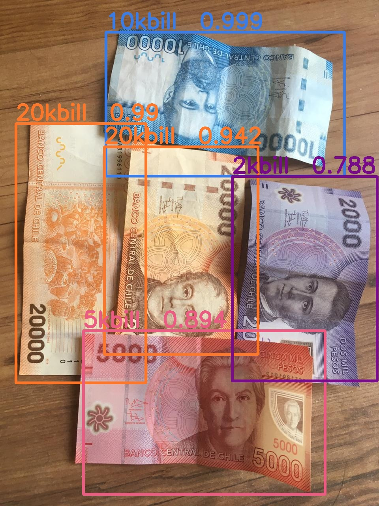

## RetinaNet para la detección de billetes

###  Referencias:

Implementación RetinaNet
```
https://github.com/fizyr/keras-retinanet/
```
Guía para utitilizar la red para cualquier dataset
```
https://github.com/Samjith888/Keras-retinanet-Training-on-custom-datasets-for-Object-Detection-/
```

### Preliminares:

Esta guía está pensada para un implementarse en un ambiente Linux. Instalar todo lo especificado en requirements.txt y ejecutar los comandos en comandos_linux.txt, en el directorio principal.
### Creación dataset:

1) Una vez que se tienen las imagenes se deben crear sus respectivas labels. Una herramienta recomendada es Labelme (python), que resultarán en labels de extensión .json.

2) Es recomendable utilizar data augmentation y ajustar las imágenes para que todas sean del mismo tamaño (en esta red se utilizó 768x1024). Además se deben cambiar las etiquetas para el formato de RetinaNet. Todas estas tareas pueden realizarse utilizando la herramienta [Roboflow](https://roboflow.com/) (notar que solo es necesario subir los archivos .json ya que imagen queda codificada en estos archivos).

3) Si se desea se debe separar en conjunto de entrenamiento y de validación, pero eso se especifica en los labels. Para este proyecto se utilizó 85% para entrenamiento.

4) Las imagenes deben ir en la carpeta /dataset/images


### Formato labels:

Si utlizó la herramienta Roboflow, tendrá que hacer unas pequeñas modificaciones para que queden en el formato exacto (mediante un simple script de procesamiento de texto). Sin importar el formato en que tenga las labels, esto se puede lograr como se estime conveniente.

En la carpeta /dataset se encuentran los archivos classes.csv, train.csv y test.csv que se utilizaron en este proyecto como ejemplo. Estos archivos deben ir en en esta carpeta

##### classes.csv

Este archivo debe contener los nombres de las clases que existen en el dataset. Escribir cada clase y su número de label (no tiene importancia el orden) en una línea (en este proyecto sería una línea por cada tipo de billete):
```
nombre_clase_0, 0
nombre_clase_1, 1
nombre_clase_2, 2
...
```
##### train.csv y test.csv

Estos archivos contienen las coordenadas de las bounding boxes para los objetos en las fotos de entrenamiento y validación respectivamente. Cada linea es de la forma:
```
path/nombre_imagen, Xmin, Ymin, Xmax, Ymax, nombre_clase
```
 Si una foto contiene más de un objeto, tendrá más de una línea en el archivo. Si el nombre de las fotos fuese f1.jpg, f2.jpg, ...etc, entonces unos ejemplos de líneas en el archivo serían:

```
images/f8.jpg,171,77,720,836,nombre_clase_3
images/f9.jpg,218,162,738,861,nombre_clase_0
images/f11.jpg,216,0,767,167,nombre_clase_2
images/f11.jpg,27,237,767,631,nombre_clase_0
...
```
### Entrenamiento

En primer lugar, descargar los pesos de Coco preentrenados ([link](https://github.com/fizyr/keras-retinanet/releases/download/0.5.1/resnet50_coco_best_v2.1.0.h5)). Para comenzar entrenando desde estos pesos, utilizar el siguiente comando en el directorio RetinaNet:
```
python keras_retinanet/bin/train.py --weights resnet50_coco_best_v2.1.0.h5 --steps 1500 --epochs 50 --snapshot-path snapshots  csv dataset/train.csv dataset/classes.csv --val-annotations dataset/test.csv | tee output.txt
```

Los pesos entrenados después de cada época se guardarán en la carpeta /snapshots. Para comenzar a entrenar desde pesos ya entrenados, utilizar el comando en el directorio RetinaNet:

```
python keras_retinanet/bin/train.py  --steps 1500 --epochs 50 --snapshot-path snapshots --initial-epoch X --snapshot snapshots/NOMBRE_PESOS.h5  csv dataset/train.csv dataset/classes.csv --val-annotations dataset/test.csv | tee output.txt
```

Ejemplo: si se especifica X=3, comenzará entrenando desde la época 4 (3+1). En el archivo train.py se encuentran todas las opciones posibles para personalizar la fase de entrenamiento. Para este proyecto se modificó para que siempre se congele el backbone y siempre se calculen los resultados de validación. Si se desea se pueden revertir estos cambios o simplemente descargar el archivo original desde las referencias indicadas al inicio.

### Detección

Antes de hacer detecciones, los pesos de entranamiento deben convertirse a pesos de inferencia utilizando el archivo convert_model.py en keras_retinanet/bin. Luego con el archivo .h5 generado se pueden hacer inferencias sobre una imagen utilizando el archivo detect.py.

Para establecer un umbral mínimo de puntaje en la detección, puede cambiarse la variable SCORE dentro del archivo detect.py.

Por supuesto deben cambiarse los nombres de los pesos e imágenes y pesos a utilizar dentro de los archivos mencionados. En la carpeta /results debería generarse un archivo de la forma:


